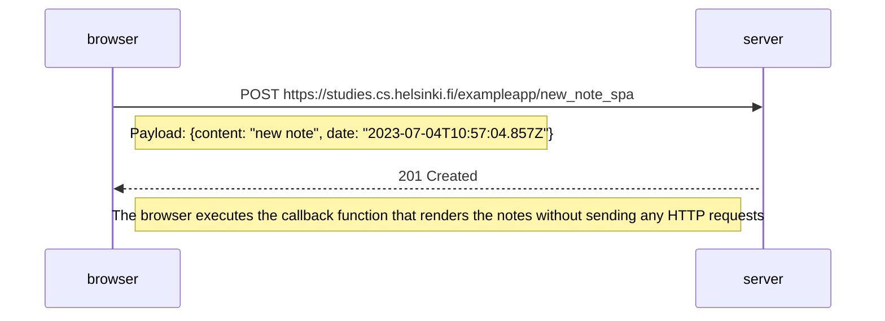

```mermaid
sequenceDiagram
    participant browser
    participant server

    browser->>server: POST https://studies.cs.helsinki.fi/exampleapp/new_note_spa

    Note right of browser: Payload: {content: "new note", date: "2023-07-04T10:57:04.857Z"}

    activate server
    server-->>browser: 201 Created

    Note right of browser: The browser executes the callback function that renders the notes without sending any HTTP requests
```
